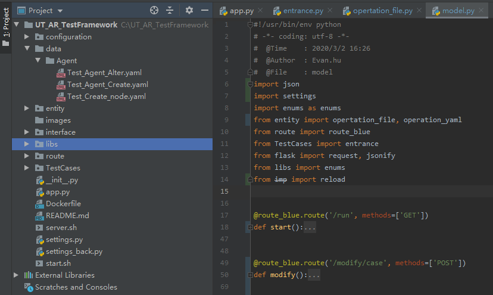
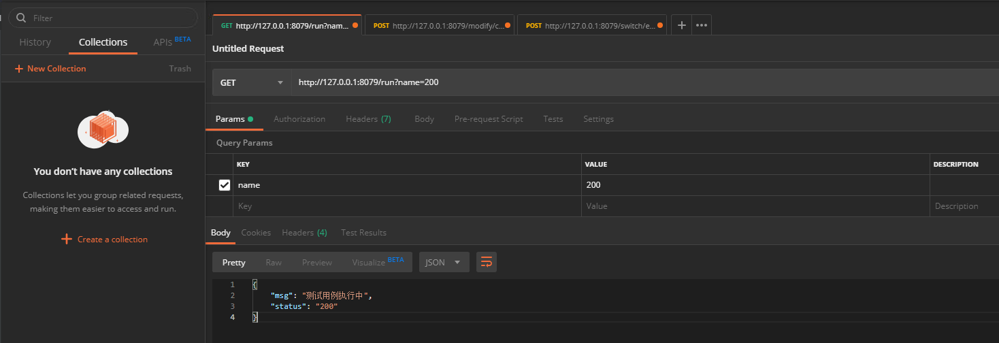
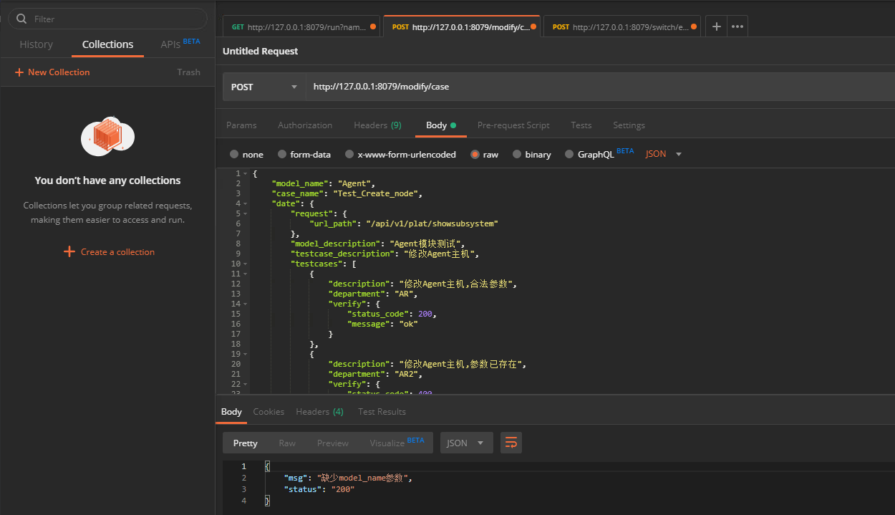
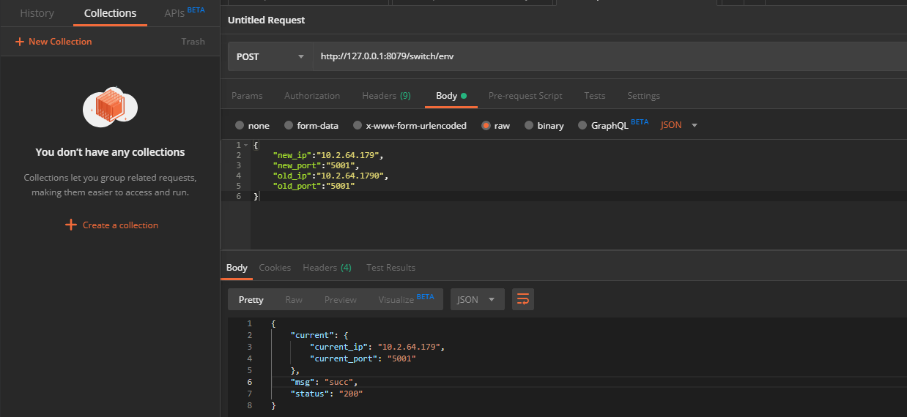
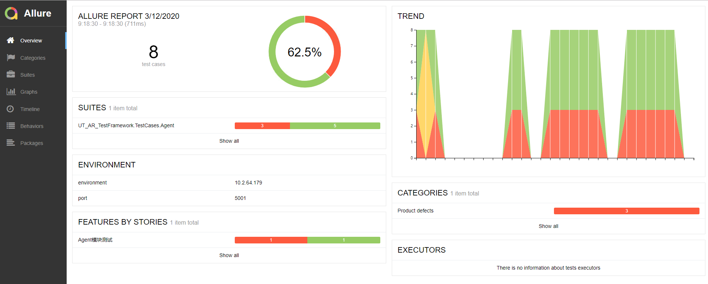

# UT_AR_TestFramework

## 1. 项目介绍

1.1 UT_AR_TestFramework是python3开发的自动化测试框架 ，集成flask , pytest , allure 

​	Flask : Flask是一个轻量级的可定制框架，使用Python语言编写

​    pytest :  pytest是一个非常成熟的全功能的Python测试框架

​    allure : Allure框架是一种灵活的轻量级多语言测试报告工具

1.2 安装版本要求

```
allure-pytest==2.8.6
allure-python-commons==2.8.6
pytest==5.3.2
```


1.3分层设计：

```python
class ClientTypeEnum(Enum):
    MODEL_NAME = {
        100: "",
        200: "Demonstration",
        300: "AgentManagement",
        400: 'DataSource'
    }

```


1.3 进准测试：根据参数运行指定测试案例


1.4测试用例数据管理：

```python
# 支持测试数据格式
DATA_TYPE = {
    "DbManagement": "yaml",
    "2": "Excel"
}
```


1. 5调试工具 ： Postman

## 2. 目录结构



## 3. 项目运行

## 4.常用接口

### 4.1）运行测试用例接口



```
URL:
	http://127.0.0.1:8079/run?name=200

接口描述:
	根据name参数运行不同模块的测试用例

HTTP请求方式：
	GET

请求参数：
    名称	   类型	  是否必须	 描述
    type	string	  是	      类型（为必选项）
```


### 4.2）精准测试

```
URL:
	http://127.0.0.1:8079/accurate/run

接口描述:
	根据参数指定运行测试用例

HTTP请求方式：
	POST

请求参数：json
{
	"target":"Agent",
	"model":"Test_Agent_Alter.py",
	"case":"Test_Agent",
	"case_method":"test_alter_agent"
}
```


### 4.3）创建和修改测试用例接口

```
URL:
	http://127.0.0.1:8079/modify/case

接口描述:
	创建和修改测试用例

HTTP请求方式：
	POST

请求参数：
    名称	           类型	  是否必须	 描述
    case_name	    string	  是	      类型（为必选项）
    model_name	    string	  是	      类型（为必选项）
    date	        JSON	  是	      类型（为必选项）
```


```json
{
    "model_name": "Demonstration",
    "case_name": "Test_Create_node",
    "date": {
        "request": {
            "url_path": "/api/v1/plat/showsubsystem"
        },
        "model_description": "Agent模块测试",
        "testcase_description": "修改Agent主机",
        "testcases": [
            {
                "description": "修改Agent主机,合法参数",
                "department": "AR",
                "verify": {
                    "status_code": 200,
                    "message": "ok"
                }
            },
            {
                "description": "修改Agent主机,参数已存在",
                "department": "AR2",
                "verify": {
                    "status_code": 400,
                    "message": "ok"
                }
            },
            {
                "description": "修改Agent主机,参数不合法",
                "department": "AR3",
                "verify": {
                    "status_code": 500,
                    "message": "ok"
                }
            },
            {
                "description": "修改Agent主机,参数为空",
                "department": "AR4",
                "verify": {
                    "status_code": 501,
                    "message": "ok"
                }
            }
        ]
    }
}
```



### 4.4）环境切换


```
URL:
	http://127.0.0.1:8079/switch/env

接口描述:
	根据name参数运行不同模块的测试用例

HTTP请求方式：
	POST

请求参数：
    名称	        类型	  是否必须	 描述
    new_ip	     string	  否	      类型
    new_port	 string	  否	      类型
    old_ip	     string	  否	      类型
    old_ip	     string	  否	      类型
    
Body:
	{
	"new_ip":"10.2.64.179",
	"new_port":"5001",
	"old_ip":"10.2.64.1790",
	"old_port":"5001"
		}
```




## 5. 测试报告



